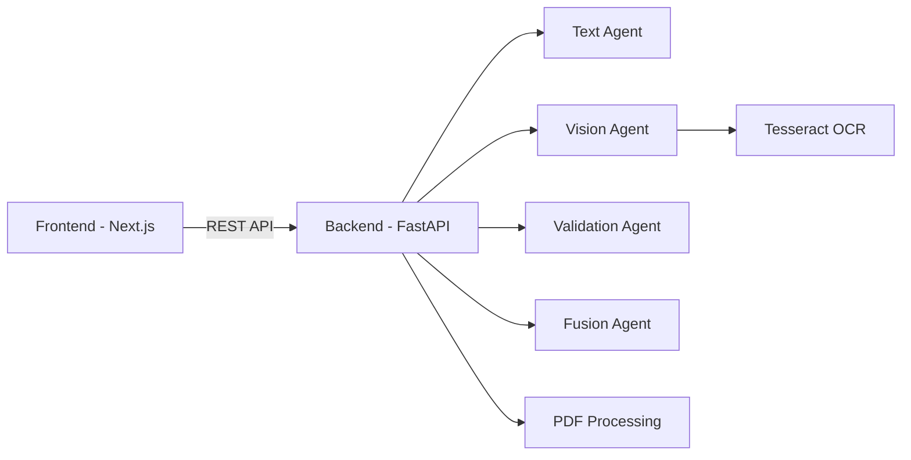

# AI Agent Builder System

A professional multi-modal AI platform with document analysis, vision processing, and intelligent agent orchestration capabilities.


## 🌟 Features

- **Multi-Modal Analysis**: Process documents with text, vision, and validation agents
- **User Authentication**: Secure signup and login system
- **Document Processing**: Upload and analyze PDFs and images
- **OCR Capabilities**: Extract text from images using Tesseract
- **Interactive Dashboard**: Modern, responsive UI for managing AI agents
- **Chat Interface**: Interactive AI-powered conversations
- **History Tracking**: View and manage analysis history

## 🏗️ Architecture



## 🚀 Quick Start

### Prerequisites

- **Backend**: Python 3.10+, Tesseract OCR
- **Frontend**: Node.js 18+

### Local Development

1. **Clone the repository**:
   ```bash
   git clone https://github.com/yourusername/ai-agent-builder-system.git
   cd ai-agent-builder-system
   ```

2. **Set up the backend**:
   ```bash
   cd backend
   pip install -r requirements.txt
   cp .env.example .env
   # Edit .env as needed
   uvicorn main:app --reload --host 0.0.0.0 --port 8000
   ```

3. **Set up the frontend** (in a new terminal):
   ```bash
   cd frontend
   npm install
   cp .env.example .env.local
   # Edit .env.local to set NEXT_PUBLIC_API_URL=http://localhost:8000
   npm run dev
   ```

4. **Access the application**:
   - Frontend: http://localhost:3000
   - Backend API: http://localhost:8000
   - API Docs: http://localhost:8000/docs

## 📚 Documentation

- [Backend Documentation](./backend/README.md) - FastAPI backend setup and deployment
- [Frontend Documentation](./frontend/README.md) - Next.js frontend setup and deployment
- [Deployment Guide](./DEPLOYMENT.md) - Step-by-step deployment instructions

## 🌐 Deployment

### Recommended Platforms

- **Backend**: [Render](https://render.com) or [Railway](https://railway.app)
- **Frontend**: [Vercel](https://vercel.com) or [Netlify](https://netlify.com)

### Quick Deploy

#### Backend to Render

1. Create a new Web Service on Render
2. Connect your GitHub repository
3. Set root directory to `backend`
4. Add environment variable: `FRONTEND_URL=https://your-frontend.vercel.app`
5. Deploy

#### Frontend to Vercel

1. Create a new project on Vercel
2. Import your GitHub repository
3. Set root directory to `frontend`
4. Add environment variable: `NEXT_PUBLIC_API_URL=https://your-backend.onrender.com`
5. Deploy

See [DEPLOYMENT.md](./DEPLOYMENT.md) for detailed instructions.

## 🛠️ Tech Stack

### Backend
- **Framework**: FastAPI
- **Server**: Uvicorn/Gunicorn
- **OCR**: Tesseract, pytesseract
- **PDF Processing**: pdfplumber
- **Computer Vision**: OpenCV
- **Containerization**: Docker

### Frontend
- **Framework**: Next.js 14
- **Language**: TypeScript
- **UI Library**: React 18
- **PDF Generation**: jsPDF
- **Styling**: CSS Modules

## 📁 Project Structure

```
ai-agent-builder-system/
├── backend/                 # FastAPI backend
│   ├── agents/             # AI agent modules
│   ├── analysis/           # Analysis management
│   ├── auth/               # Authentication
│   ├── main.py             # FastAPI app
│   ├── requirements.txt    # Python dependencies
│   └── Dockerfile          # Docker configuration
├── frontend/               # Next.js frontend
│   ├── app/                # Next.js pages
│   ├── public/             # Static assets
│   ├── package.json        # Node dependencies
│   └── tsconfig.json       # TypeScript config
├── DEPLOYMENT.md           # Deployment guide
└── README.md               # This file
```

## 🔧 Configuration

### Backend Environment Variables

| Variable | Description | Default |
|----------|-------------|---------|
| `FRONTEND_URL` | Frontend URL for CORS | `http://localhost:3000` |
| `PORT` | Server port | `8000` |
| `ENVIRONMENT` | Environment name | `development` |

### Frontend Environment Variables

| Variable | Description | Default |
|----------|-------------|---------|
| `NEXT_PUBLIC_API_URL` | Backend API URL | `http://localhost:8000` |

## 🧪 API Endpoints

### Health Check
```http
GET /health
```

### Authentication
```http
POST /auth/signup
POST /auth/login
```

### Analysis
```http
POST /analyze
```

For complete API documentation, visit `/docs` when running the backend.

## 🤝 Contributing

1. Fork the repository
2. Create a feature branch (`git checkout -b feature/amazing-feature`)
3. Commit your changes (`git commit -m 'Add amazing feature'`)
4. Push to the branch (`git push origin feature/amazing-feature`)
5. Open a Pull Request

## 📝 License

This project is licensed under the MIT License.

## 🐛 Troubleshooting

### Common Issues

**CORS Errors**
- Ensure `FRONTEND_URL` in backend matches your frontend URL exactly
- Verify `NEXT_PUBLIC_API_URL` in frontend points to the correct backend

**Tesseract Not Found**
- Install Tesseract OCR on your system
- On Windows, add Tesseract to PATH

**Port Already in Use**
- Change the port in the run command
- Backend: `--port 8001`
- Frontend: Next.js will auto-suggest an alternative port

For more troubleshooting, see the [Backend README](./backend/README.md) and [Frontend README](./frontend/README.md).

## 📧 Support

For issues and questions, please open an issue on GitHub.

---

**Built with ❤️ using FastAPI and Next.js**